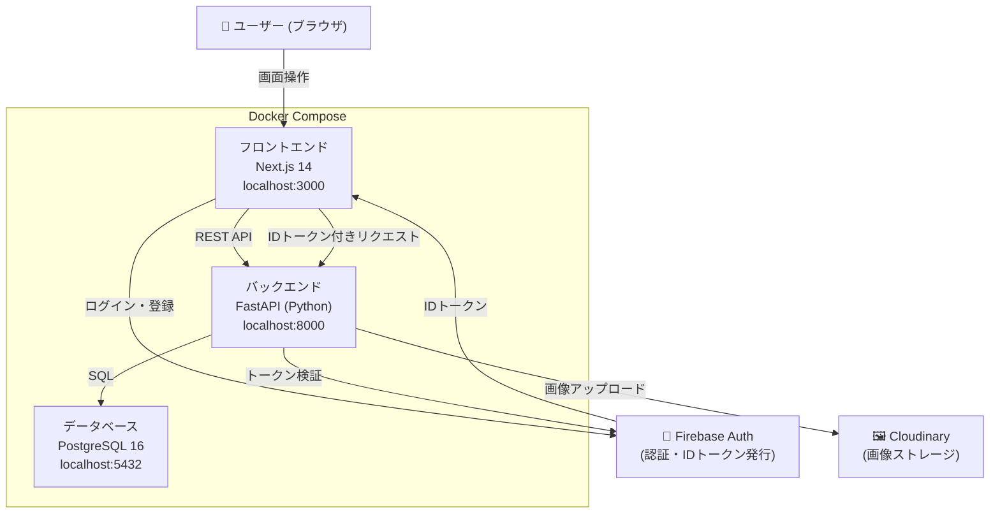

# 🍳 ふわっとレシピ

## 企画

「ふわっとレシピ」を気軽に共有するサイト

### Issue
 
- **誰の課題？**：  
普段、料理を「大さじ・小さじ」できっちり計らず、目分量やニュアンスで作っているすべての人（全世代）。および、きっちりしたレシピ通りに作ろうとして疲れてしまう人。

- **なにに困っている？**：  
世の中のレシピサイトは「醤油：大さじ2、みりん：大さじ1、弱火で5分」と細かく書く必要があり、投稿するのも書くのもめんどくさい。「いつも目分量だけどめちゃくちゃ美味しくできる、我が家の定番」があっても、正確な分量が分からないから投稿できない。読む側も、いちいち計量スプーンを出すのが手間に感じている。

- **本来はどうあるべき？**：  
「醤油をたらーっと1周」「いい感じに火が通ったら完成」といった、普段みんなが本当にやっている『ふわっとした感覚』のまま、気楽にレシピを記録・共有できて、それを見た人も「これくらい適当でいいんだ！」と気楽に料理を楽しめる場所。

- **既存のソリューションは？**：  
クックパッドやクラシル（グラム単位・大さじ単位の正確性が求められる、しっかりしたレシピが主流）。

- **その課題が解決されたらいくら払う？**：  
200円 / 月（料理のプレッシャーから解放され、毎日の自炊が圧倒的に気楽になる「心の保険代」として。あるいは、お気に入りの投稿者の『適当だけど美味い技』を見られるファン的な対価として）。

### Solution
 
- **どうやって解決する？**：  
計量なしでもOKな、ニュアンス重視のレシピ共有プラットフォーム。
投稿フォームから「大さじ」「グラム」といったカチッとした単位の入力をあえて無くす。
Next.js（フロント）では、タイムライン風に「今日こんなの適当に作ったよ」と写真（Cloudinary）1枚と一言だけでサクッと投稿できる超シンプルな画面にする。

- **実現できたら実際に解決できる？**：  
解決できる。投稿の心理的ハードルが「Twitter（X）に写真を上げる」くらいまで下がるため、シニア層から若者まで一気にレシピが集まる。きっちり計るのが苦手な人でも、安心して自炊のレパートリーを増やせる。

- **優位性は？**：  
「正確で正しいレシピ」が溢れるネットにおいて、唯一無二の「一番ハードルが低くて、一番自炊のリアルに寄り添った優しさ」。

- **デメリットや副作用はある？**：  
「料理を完全イチから学びたい超初心者」や「お菓子作りのように正確な分量を知りたい人」にとっては、再現するのが少し難しい（「塩小さじ1って具体的に何グラム？」と思ってしまう）。

- **デメリットと天秤にかけてもこのソリューションを使うべき？**：  
Yes
カチッとしたレシピが欲しい人は既存のサイトを見ればいいので、このサイトは「料理に慣れてきて、適当にバリエーションを増やしたい人」や「ズボラに楽しみたい人」にターゲットを絞り、この手軽さを最大の武器にするべきである。

## アーキテクチャ図

<!-- TODO: システム構成図（C4 / 簡易構成図）をここに貼る。draw.io / Mermaid いずれでも可。-->

 
---

## ディレクトリ構成
 
```
recipe-app/
├── docker-compose.yml
├── .env.example
├── docs/
│   ├── 技術選定書.md
│   ├── テスト設計書.md
│   └── 統合テストシナリオ.md
├── frontend/                      # Next.js + TypeScript
│   ├── Dockerfile.dev
│   ├── package.json
│   └── src/
│       ├── app/                   # ページ (App Router)
│       │   ├── page.tsx           # トップページ
│       │   ├── login/page.tsx     # ログイン
│       │   ├── register/page.tsx  # 新規登録
│       │   └── recipes/page.tsx   # レシピ一覧
│       ├── lib/                   # API クライアント・認証Context
│       │   ├── api.ts
│       │   └── auth-context.tsx
│       └── types/                 # 型定義
│           └── index.ts
└── backend/                       # Python + FastAPI
    ├── Dockerfile.dev
    ├── requirements.txt
    ├── seed.py                    # テストデータ投入
    ├── alembic/                   # DBマイグレーション
    │   └── versions/
    └── app/
        ├── main.py
        ├── api/v1/                # エンドポイント
        │   ├── auth.py            # 認証
        │   ├── recipes.py         # レシピCRUD
        │   ├── users.py           # ユーザー
        │   └── deps.py            # 認証共通処理
        ├── core/                  # 設定・DB・セキュリティ
        │   ├── config.py
        │   ├── database.py
        │   └── security.py
        ├── models/                # SQLAlchemy モデル
        ├── schemas/               # Pydantic スキーマ
        ├── services/              # 外部サービス連携
        │   └── cloudinary.py      # 画像アップロード
        └── tests/                 # 単体テスト
            ├── test_security.py
            └── test_recipes.py
```
 
---

## 開発の始め方

- フロントエンド：[frontend/README.md](./frontend/README.md)
- バックエンド：[backend/README.md](./backend/README.md)

## ドキュメント

## 企画・要件

- [要件定義書](./docs/要件定義.md)

## 設計

- [技術選定](./docs/技術選定.md)
- [画面設計書](./docs/画面設計.md)
- [API設計書](./docs/API設計.md)
- [DB設計書](./docs/DB設計.md)

## テスト設計

- [テスト設計書](./docs/テスト設計書.md)


## ブランチ運用ルール

### ブランチ構成

```
main        ← 本番リリース用（直接pushしない）
 └── develop ← 統合ブランチ（各featureのマージ先）
       └── feature/xxx ← 各担当者の作業ブランチ
```

### 作業の流れ

```bash
# 1. developブランチを最新にする
git switch develop
git pull origin develop

# 2. featureブランチを作成（developから派生）
git switch -c feature/作業内容

# 3. 作業・コミット
git add .
git commit -m "feat: 〇〇を実装"

# 4. developにPull Requestを出す
git push origin feature/作業内容
# → GitHubでPRを作成 → レビュー → developにマージ
```

### ブランチ命名規則

| 種別         | 形式                | 例                       |
| ------------ | ------------------- | ------------------------ |
| 環境構築     | `feature/setup-xxx` | `feature/setup-docker`   |
| 機能追加     | `feature/add-xxx`   | `feature/add-board-crud` |
| バグ修正     | `fix/xxx`           | `fix/auth-middleware`    |
| ドキュメント | `docs/xxx`          | `docs/design-document`   |

### コミットメッセージ規則

| プレフィックス | 用途                   |
| -------------- | ---------------------- |
| `feat:`        | 新機能の追加           |
| `fix:`         | バグ修正               |
| `docs:`        | ドキュメントのみの変更 |
| `chore:`       | 設定ファイル・環境構築 |
| `test:`        | テストの追加・修正     |
| `refactor:`    | リファクタリング       |

---

## セットアップ（初回）

### 1. リポジトリをクローン

```bash
git clone <リポジトリURL>
cd recipe-app
```

### 2. 環境変数を設定

```bash
cp .env.example .env
# 必要に応じて .env を編集
```

### 3. Docker で起動

```bash
docker compose up --build
```

| サービス         | URL                        |
| ---------------- | -------------------------- |
| フロントエンド   | http://localhost:3000      |
| バックエンド API | http://localhost:8000      |
| API ドキュメント | http://localhost:8000/docs |

## 日常の開発フロー

```bash
# 起動
docker compose up

# 停止
docker compose down

# DBのデータも含めて全削除
docker compose down -v

# ログ確認
docker compose logs -f backend
docker compose logs -f frontend
```
